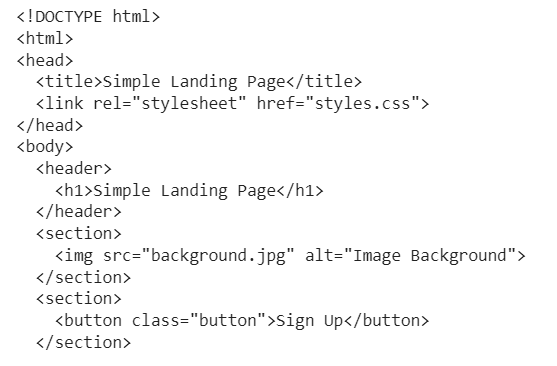

## Using Llama 2 Model with HTML Dataset

This repository will consists of Llama2 Model from Meta customized with HTML dataset. The link for the dataset is here https://huggingface.co/datasets/jawerty/html_dataset.  The main focus of the model is to take the natural language from the user, and provides based HTML script. The link for the model is here. 

### Sample Input and Output
Input: Generate an HTML Code for Simple Landing Page 

Output: 

#### Step 1: Model Loading and Fine Tuning
Model can be found from the link https://github.com/facebookresearch/llama. Otherwise, you can also the Hugging Face Repo to load the model with the help of Transformers Library. 
Normal Dataset from the Hugging Face Repo - Doesn't have the split of train and test. 
So used manually to split the dataset into train and test. 

#### Step 2: Tokenizing the Dataset
Used the pretrained tokenizer from AutoTokenizer to tokenize the dataset. Moreover, the tokenizer is supported with QLoRA Configuration

#### Step 3: Loading the Model 
From the pretrained from AutoModelForCasualLM, the model has been trained. Used QLoRA (Quantized Low Rank Adaption Technique) to optimize the model with paramter values. bnb -- bitesandbytes was the major issue which was faced. Due to memory capability, and the information got from the bitsandhytes repo, the code turned out to be dirty. 

So, to test the model, the same code has been run with Google Colab, and it does well. So, finding the `libcudart.so` file was the major issues which was arised. Then using the instructions followed from the command `python -m bitsandbytes`, some of the errors have been rectified. The Major issue is that, even though the GPU is being enabled, it cannot be activated when running the code. 
Some of them are listed below
1. Checking whether nvcc (Nvidia Cuda Library) is being installed or not with Pytorch Support
2. After checking, if it is installed, 
    - Findng the location of the libcudart.so file using `find` command. 
    - After locating the file, pasting the path of the file in the file `./bashrc`
3. If the Nvidia Cuda Toolkit is not installed, using the `pip` command from pytorch official library

#### Step 4: Used both SFTTrainer and Python Loop to evaluate the model
Used Supervised Fine Tuning Trainer and Python Loop to evaluate the model on both training and testing the model. Once the model is trained, the model is stored with the new_name variable. 

Used BLEU Score (BiLingual Evaluation UnderStudy) is the major metric, I've used to evalute the model. Moreover, there are some other evalutaion metrics such as Perplexity, but I found BLEU would be the best source for evaluating the model. Here are the test results

| Dataset  | BLEU Score | Precision | brevity_penalty | length_ratio | translation_length | reference_length |
| ------------- | ------------- | ------------- | ------------- | ------------- | ------------- | ------------- |
| Training  | 0.0  | [0.0, 0.0, 0.0, 0.0] | 1.0 | 257.5 | 515 | 2 |
| Testing  | 0.0  | [0.0, 0.0, 0.0, 0.0] | 1.0 | 9.0 | 9 | 1 |

#### Step 5: API to integrate with the Model
Used Flask API to create an endpoint for the user to integrate with the natural language prompt. 

## License
[llama2] {}
